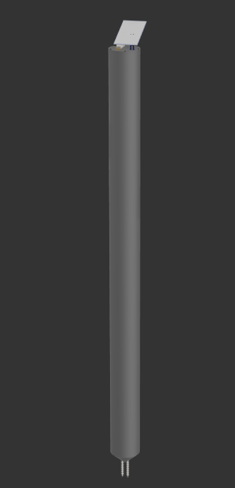

# 🌍 TerraSafe

> **Intelligent Landslide Alert and Prevention System**  
> SmartCamp 2026,Viçosa Smart TecnoParque UFV,Challenge 3: Heavy Rain and Flood Simulation

---

## 🏆 1st Place,Bootcamp Smart Cities · UFV · June 2026

TerraSafe won **1st place** (R$ 2,000 prize) at the **SMARTCAMP de Cidades Inteligentes**, organized by the [Viçosa SMART](https://centev.ufv.br) project in partnership with **LabMAKER (TecnoParque/UFV)** and **VUEI UFV**, held on June 13–14, 2026 in Viçosa, MG.

> [Read the official article (pt-BR) →](https://centev.ufv.br/solucoes-para-desafios-urbanos-marcam-o-bootcamp-cidades-inteligentes-do-tecnoparq-ufv/)

---

## Why it exists

In February 2026, the Zona da Mata region of Minas Gerais experienced one of its worst climate disasters: **72 confirmed deaths** across the municipalities of Juiz de Fora and Ubá, over 5,500 people displaced, and 752 mm of rainfall accumulated in a single month in Juiz de Fora,the highest reading ever recorded by INMET.

Viçosa sits in the same region. Under the same risks.

The problem is not the absence of climate forecasting,INMET already issues rainfall warnings. The problem is that **a rain alert is not a landslide alert**. 50 mm of rain on dry soil is absorbed without consequence. The same rain on already-saturated soil can trigger a landslide within hours. No system currently deployed in Viçosa monitors the actual state of the soil on critical hillsides.

> *"Traditional systems say: it's going to rain. TerraSafe says: this hillside is going to collapse."*

---

## What it is

TerraSafe is a distributed network of low-cost IoT sensors (~R$ 30–40/unit) that monitor **soil moisture**, **tilt**, **precipitation**, and **environmental conditions** in real time at strategic risk points. Data is fed into a web platform with a live risk map and preventive alerts for Civil Defense agencies and residents.

---

## Architecture

```
[EPD Nodes] --ESP-NOW--> [CPD Hub] --Serial--> [serial_bridge.py] --HTTP--> [FastAPI Backend] --> [Vue 3 Frontend]
```

| Component | Description |
|---|---|
| **EPD** (Environmental Probe Device) | ESP32 sensor node buried in soil |
| **CPD** (Central Processing Device) | ESP32 hub that aggregates EPD data and forwards via serial |
| **serial_bridge.py** | Reads CPD serial output and POSTs to the backend |
| **Backend** | FastAPI REST API that computes risk levels and stores readings |
| **Frontend** | Vue 3 SPA with a Leaflet map showing real-time sensor status |

---

## Hardware

<p align="center">
  <br/>
  <sub>CAD by <a href="https://www.instagram.com/dahrb_/">Davi Brito</a> · Mechanical Engineering student</sub>
</p>

Each EPD unit is assembled inside a weatherproof cylinder installed vertically in the soil (~1 meter total):

| Component | Role | Notes |
|---|---|---|
| ESP32 DoiT DevKit v1 | Microcontroller |,|
| DHT11 | Air temperature & humidity | Exposed section (~20 cm) |
| Capacitive soil moisture sensor | Soil saturation | Pin 34,buried section (~80 cm) |
| MPU6050 | Tilt detection via 3-axis accelerometer | I2C: SDA=21, SCL=22 |
| Li-Ion 18650 battery | Autonomous power supply | Estimated autonomy: 3 days |

EPD nodes send a packed struct to the CPD every **2 seconds** over **ESP-NOW** (no router required). The CPD outputs a JSON batch over serial, which `serial_bridge.py` reads and POSTs to the backend.

---

## Risk Levels

Risk is computed from soil moisture and tilt detected by the MPU6050:

| Level | Condition |
|---|---|
| `SAFE` | Soil moisture < 10% |
| `ATTENTION` | Soil moisture ≥ 10%,or sensor tilted but soil dry |
| `HIGH` | Soil moisture ≥ 25% |
| `CRITICAL` | Soil moisture ≥ 70%,or sensor tilted + moisture ≥ HIGH |

> A tilted sensor (MPU6050 X-axis < 45° from vertical) combined with high moisture indicates an imminent or ongoing landslide.

---

## Project Structure

```
terrasafe/
├── firmware/
│   ├── epd/          # Sensor node firmware (DHT11 + soil + MPU6050 + ESP-NOW)
│   ├── cpd/          # Hub firmware (ESP-NOW receiver → Serial JSON output)
│   └── test/         # Standalone sensor tests
├── software/
│   ├── backend/      # FastAPI + SQLAlchemy async
│   └── frontend/     # Vue 3 + Vite + TypeScript + Leaflet
└── cad/              # Hardware design files / housing
```

---

## Getting Started

### Prerequisites

- [PlatformIO](https://platformio.org/) for firmware
- Python 3.11+
- Node.js 18+

---

### Firmware

```bash
# Flash EPD sensor node
cd firmware/epd
pio run --target upload

# Flash CPD hub
cd firmware/cpd
pio run --target upload
```

---

### Serial Bridge

Reads CPD serial output and forwards to the backend:

```bash
cd firmware/cpd
python serial_bridge.py
```

---

### Backend

```bash
cd software/backend
pip install -r requirements.txt
uvicorn app.main:app --reload
```

API at `http://localhost:8000`,Docs at `http://localhost:8000/docs`

Key environment variables (`.env`):

```env
DATABASE_URL=sqlite+aiosqlite:///./terrasafe.db
CORS_ORIGINS=http://localhost:5173
```

---

### Frontend

```bash
cd software/frontend
npm install
npm run dev
```

App at `http://localhost:5173`. API calls are proxied to `localhost:8000`.

> **Demo mode**: The `/simulador` route runs entirely in the browser with no backend required,it uses the browser's Geolocation API to place a virtual sensor at your current position, with sliders to vary readings and preset scenarios (Safe → Critical).

---

## API Overview

| Method | Endpoint | Description |
|---|---|---|
| `POST` | `/api/v1/cpd/batch` | Ingest a batch of readings from the CPD |
| `GET` | `/api/v1/epd/` | List all active EPDs with latest reading |
| `GET` | `/api/v1/epd/{uid}/history` | Reading history (default: last 10 min) |
| `GET` | `/api/v1/weather/current` | Current weather via Open-Meteo |
| `GET` | `/api/v1/weather/rain-grid` | 3×3 rainfall grid around deployment area |
| `GET` | `/api/v1/mock/epds` | 100 deterministic demo sensors |
| `GET` | `/api/health` | Health check |

---

## Tech Stack

| Layer | Stack |
|---|---|
| Firmware | C++ (Arduino framework), PlatformIO, ESP-NOW |
| Backend | Python, FastAPI, SQLAlchemy 2.0 (async), SQLite / PostgreSQL, Alembic |
| Frontend | Vue 3, TypeScript, Vite, Vue Router, Leaflet, leaflet.heat, Vue-i18n (pt-BR / en-US) |
| Weather | [Open-Meteo](https://open-meteo.com/) (no API key required) |

---

## Scalability

| Phase | Scope |
|---|---|
| **Hackathon** | 1–3 sensors. Functional dashboard. Proof of concept. |
| **Municipal pilot** | 50–200 sensors at Civil Defense risk points across Viçosa |
| **Regional scale** | 1,000–5,000 sensors across Zona da Mata. Integration with SGB and CEMADEN. |
| **Commercial product** | SaaS for municipalities + hardware. Expansion into precision agriculture. |

The same sensor that detects hillside collapse also monitors soil health on farmland,moisture, temperature, and tilt data have direct value for precision irrigation and agricultural traceability.

---

## References

- [Agência Brasil,73 deaths in MG floods (01/03/2026)](https://agenciabrasil.ebc.com.br/geral/noticia/2026-03/sobe-para-72-o-numero-de-mortos-nas-chuvas-em-minas-gerais)
- [SGB,Prevention saved R$800M in losses in 2023](https://www.sgb.gov.br/sala-de-imprensa/-/asset_publisher/ujyx/content/prevencao-de-desastres-servico-geologico-do-brasil-evitou-prejuizos-de-r-800-milhoes-em-2023)
- [leodesigner/espNowFloodingMeshLibrary2](https://github.com/leodesigner/espNowFloodingMeshLibrary2),ESP-NOW mesh library with AES128
- [Inform@Risk (Medellín)](https://pmc.ncbi.nlm.nih.gov),Open-source IoT LEWS in informal communities
- [FOSS-Hack-AI-IoT-Landslide-Early-Warning-System](https://github.com/Agalya-2006/FOSS-Hack-AI-IoT-Landslide-Early-Warning-System),Similar project from a 2026 hackathon

---

*Built during SmartCamp 2026,TecnoParque UFV,Viçosa, MG*  
*"The difference between a weather alert and a disaster alert can be the difference between a family that evacuates in time and a tragedy."*
